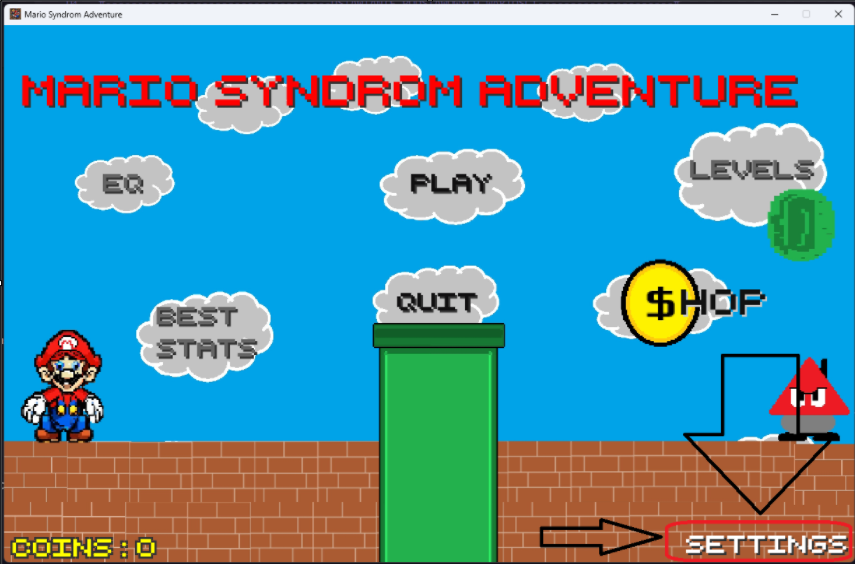

# Mario Syndrome Adventure

Authors: Me

## Introduction

Mario Syndrome Adventure is a game inspired by Super Mario Bros. The main objective is to navigate through levels of increasing difficulty. Players start with basic levels and can unlock hidden levels that offer additional challenges and coins. You have 3 lives to complete each level. The penultimate level features a boss named Henryk Silverhand, requiring a purchased or selected weapon to defeat him. To cheat, enter the file `WYMAKSOWANY.txt` and paste its content into `best.txt`.

## Controls

- **Move Left** - Left Arrow
- **Move Right** - Right Arrow
- **Jump** - Space
- **Fire Weapon** - "Z" Key
- **Jump Into Pipe** - "E" Key
  

The default controls can be changed in settings
## Development Process

The initial idea was to create a game similar to Mario Bros, but with unique and humorous elements. Weapons and interesting sounds were added to enhance the gameplay. Overcoming the 400 lines of code mark was challenging, but progress became smoother afterward. Hitbox issues were frequent and remain in some areas. After upgrading the game with weapons, sound design became a focus. Bartuś (Mr. Bartek Łączkowski) recorded the Mario song on electric guitar for the boss fight. For the main gameplay, a classical guitar version was edited to loop properly and added with Bartek's permission.

## Resources and Sounds
- **Game Music** – MADE BY BARTEK <3
- **Sound Effects** – [Sound effects](https://www.myinstants.com/en/categories/sound%20effects/) and my friend Tomek (IG: broda_t351) (“good coin” and “ITSA MI MARIUSZ AUTYSTA”)
- **Characters** – Created by me (In Paint)
- **Fonts** – [Google Fonts](https://fonts.google.com/)

## Known Bugs

Hitbox issues persist. On school computers, the game lagged significantly, running at 16 FPS, possibly due to weak processors or subprocesses. Additionally, the `\n` escape sequence did not function correctly. Apologies if these errors occur.

## Time Spent on the Game

Approximately 50 hours
